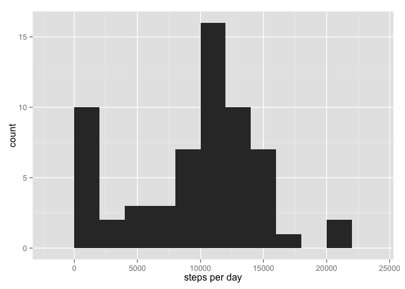
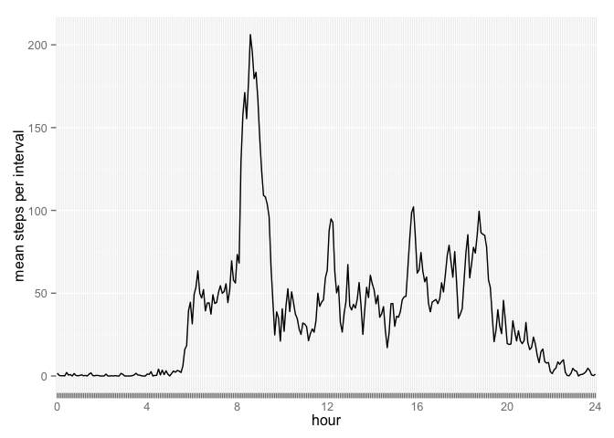
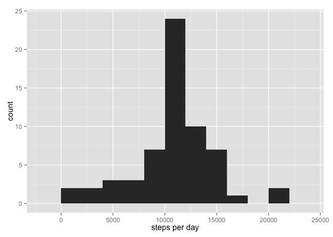
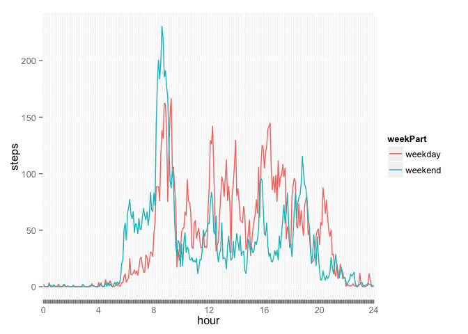

# Reproducible Research: Peer Assessment 1


## Loading and preprocessing the data

Treat interval like an ordered factor rather than an integer. It is really structured as HMM, where H is the hour and MM is the
minutes, so it isn't a good fit for an integer variable.


```r
activityMonitorData <- read.csv("activity.csv")
activityMonitorData$date <- as.Date(activityMonitorData$date)
activityMonitorData$interval <- ordered(activityMonitorData$interval)
```

We are going to use the following two values in subsequent calculations, so extract them here:


```r
dates = unique(activityMonitorData$date)
intervals = unique(activityMonitorData$interval)
```

And we'll need these libraries:


```r
library(ggplot2)
library(reshape2)
```

## What is mean total number of steps taken per day?

We compute and plot stepsPerDay using a histogram with a bin width of 2000. A bin width of 1000 is too spikey, 2000 was 
chosen as the next round number. 


```r
stepsPerDay = sapply(dates, function(x) sum(activityMonitorData[activityMonitorData$date == x,]$steps, na.rm=TRUE))

qplot(stepsPerDay, binwidth=2000, xlab="steps per day")
```

 

Given  *stepsPerDay*, we can easily compute the mean and median using the built-in functions:


```r
mean(stepsPerDay)
```

```
## [1] 9354.23
```


```r
median(stepsPerDay)
```

```
## [1] 10395
```


## What is the average daily activity pattern?


```r
meanStepsPerInterval = sapply(intervals, function(x) 
    mean(activityMonitorData[activityMonitorData$interval == x,]$steps, na.rm=TRUE))

# the default labels for intervals are unreadable since there are too many in too small a space,
# so make new ones that only put a label every four hours:

interval_labels = sapply(intervals, function(x) ifelse(as.integer(x)%%48==1, (as.integer(x)-1)/12, ""))
interval_labels[length(interval_labels)] = 24 # This is really at 2355, but it makes things look better

(qplot(intervals, meanStepsPerInterval, geom="line", group=1, ylab="mean steps per interval")  
 + scale_x_discrete("hour", labels=interval_labels))
```

 

The interval with the maximum steps is determined using *which.max* to determine the 
index of appropriate interval and then looking up the interval using its index.


```r
intervalWithMaxSteps = intervals[which.max(meanStepsPerInterval)]
intervalWithMaxSteps
```

```
## [1] 835
## 288 Levels: 0 < 5 < 10 < 15 < 20 < 25 < 30 < 35 < 40 < 45 < 50 < ... < 2355
```


## Imputing missing values

To impute the NA values, that is to replace them with some sensible value, the mean value for that interval over all 
days where the value is not NA is used. The function *imputeValueForMissingStep* returns the step value if it exists, 
otherwise it returns the mean.  This is used in conjuction with *sapply* to create a new data frame with imputed values.


```r
# Return $steps from activityMonitorData where any NAs have been replaced
# with the meanValue for the interval of the step measurement
imputeValueForMissingStep <- function(i) {
    if (is.na(activityMonitorData[i,'steps'])) {
        return( meanStepsPerInterval[activityMonitorData[i,'interval']] )
    } else {
        return( activityMonitorData[i,'steps'] )
    }
}

imputedSteps = sapply(1:length(activityMonitorData$steps), imputeValueForMissingStep)
imputedActivityMonitorData = data.frame(steps = imputedSteps, 
                                        date = activityMonitorData$date, 
                                        interval = activityMonitorData$interval)
```

Given *imputedActivityMonitorData*, we can easily replot the total steps per day and compute the mean and median in the same manner
that we did above.


```r
imputedStepsPerDay = sapply(dates, function(x) 
    sum(imputedActivityMonitorData[imputedActivityMonitorData$date == x,]$steps, na.rm=TRUE))

qplot(imputedStepsPerDay, binwidth=2000, xlab="steps per day")
```

 


```r
mean(imputedStepsPerDay)
```

```
## [1] 10766.19
```


```r
median(imputedStepsPerDay)
```

```
## [1] 10766.19
```

The imputation has pulled the mean up significantly, but only pulled the median up slightly. 

It is interesting, but upon reflection, not surprising that the mean and median  have the same value. We now have 
many days that have steps per day equal to the mean number of steps per day due to the impuation of missing values. 
One of these turns out to be the median value and thus the mean and median are equal. 

## Are there differences in activity patterns between weekdays and weekends?

To determine this we plot the data using ggplot. The challenge here is to get the data into a data frame that ggplot will accept. 
The trick is create a data set with "normal" columns and then *melt* it into a tidy dataset.


```r
isWeekend <- function(date) {
    return( weekdays(as.Date(date)) %in% c('Saturday','Sunday') )
}

imputedActivityMonitorData$weekPart = factor(sapply(imputedActivityMonitorData$date, isWeekend), 
                                             labels=c("weekday", "weekend"))

computeMeansPerInterval <- function(weekPart) {
    dframe <- imputedActivityMonitorData[imputedActivityMonitorData$weekPart == weekPart,]
    sapply(intervals, function(x) mean(dframe[dframe$interval == x,]$steps))
}

imputedMeanStepsPerInterval = melt(data.frame(interval = intervals,
                                              weekday = computeMeansPerInterval("weekday"), 
                                              weekend = computeMeansPerInterval("weekend")),
                                   measure.vars=c("weekday", "weekend"), 
                                   variable.name="weekPart", 
                                   value.name="steps")
```


```r
print(ggplot(imputedMeanStepsPerInterval, aes(x=interval, y=steps, group=weekPart)) 
 + geom_line(color="blue") 
 + facet_wrap(~weekPart)
 + scale_x_discrete("hour", labels=interval_labels))
```

 

There appear to be two differences between weekdays and weekends. First steps ramp up earlier on weekdays, presumably because of
work schedules. However, during the day, there are somewhat more steps on weekends, presumably because one is free to wander 
around when not at work.
